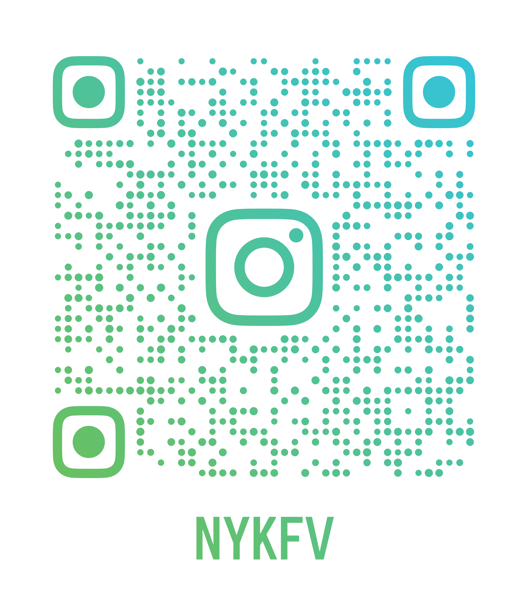

# Photos

This is a space for photos I took of my travels, just for fun. I'm organizing this in pages I'm calling "albums" based on the format `YYYY/Location`. Use the navigation menu on the left, or the search bar at the top to explore different albums through some of my adventures. Don't know where to start? Check out my [favorite](./favorites.md) photos! Additionally, you may follow [@nykfv](https://www.instagram.com/nykfv/) on Instagram for even more photos.

[{ style="display:block;margin:auto;max-width:50%;height:auto;" }](https://www.instagram.com/nykfv/)

I live in Northern California and many of these locations are local parks and preserves. As of %TODAY%, I have visited [16/50 US states](./map.md).

## Camera
I currently am using a Canon PowerShot A3500 IS, with mainly stock settings. This is my first camera. A few of the earlier photos on this website are also taken with my phone (Samsung Galaxy A10e) camera.

## About this Website
This website was generated using `mkdocs` using a customized `mkdocs-material` theme, with embedded Instagram posts. This website is built automatically, so if you notice something wrong with the website, feel free to shoot me an email. Follow the links at the footer of each page to visit my homepage, to send me an email, or to explore some of my socials and other online presences.