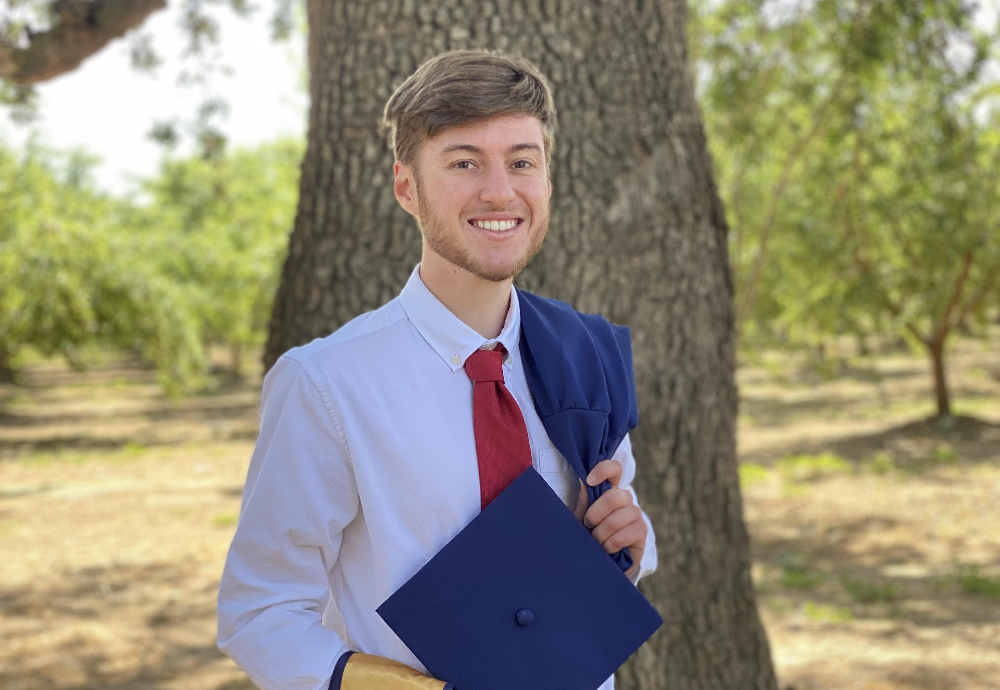

# About Me

## Welcome to my website!

Hello, world! My name is Nicolas Ventura, or Nic. I am currently a graduate student at the Univerisity of California, at Davis. I graduated in 2021 with a B.S. in mechanical engineering and again in 2022 with a master's degree in mechanical and aerospace engineering, with a focus on computational science and analysis. I have had several diverse experiences, ranging from competing in a business startup incubator, to game development, to energy efficiency.

Aside from engineering, I am also passionate about running, biking, and camping, as well as skiing in the winter time. Because I am currently living in northern California, the mountains at Lake Tahoe are one of my favorite places to ski. I can speak English, French, and a little bit of Spanish. I also am a connoisseur of all things Star Wars. Feel free to send me an email if you would like to talk about any interests that we share, or if you are interested in working together!

## Learn more

### Resume

* [Download Resume](Resume.pdf)
* [Linkedin](https://www.linkedin.com/in/nfv/)

### Work experiences

* [Berkeley Lab](lbl)
* [Electronic Arts](ea)
* [Teaching @ UC Davis](ta)

### Educational Experience

* [UC Davis](ucd)