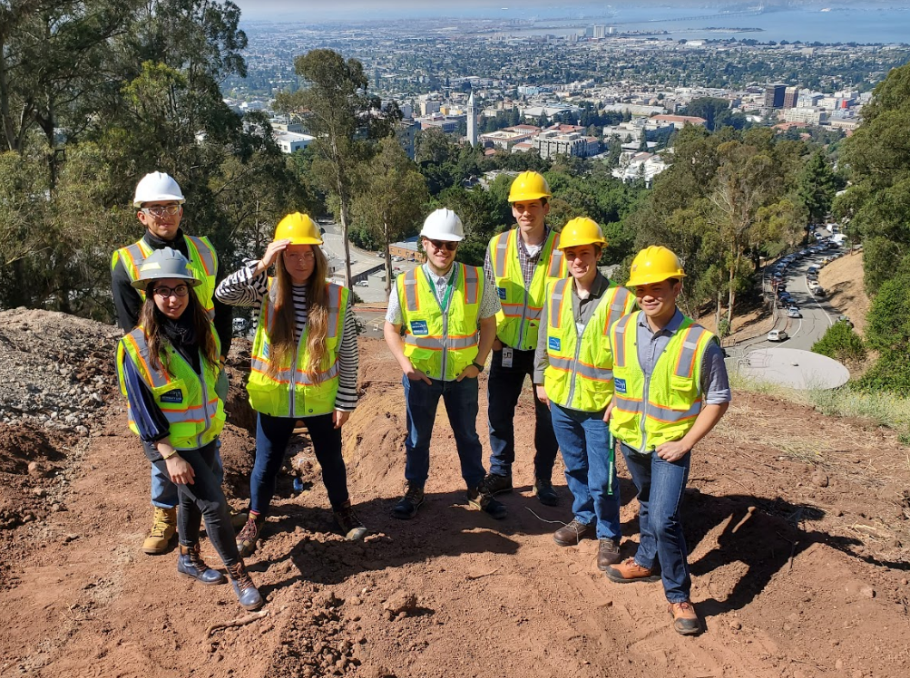

# Berkeley Lab

[Go Back](/)

## Facilities

I worked at the [Lawrence Berkeley National Laboratory](https://www.lbl.gov/) with the facilities division in 2019 as a SULI (Science Undergraduate Laboratory Internship) intern. I was hired as an asset integrity verification engineer. That job entailed verifying outdated source drawings, conducting field surveys, and using those findings to create updated drawings in AutoCAD. The final deliverables per laboratory building were packets of updated airflow schematics and P&ID's (piping and instrumentation diagrams) as well as an updated list of mechanical assets. These packets of drawings helped streamline the workflow of my mentor who would organize projects for operating, maintaining, or upgrading laboratory facilities. All of this work supported the ongoing science of the lab.

_Me (second from right) with the 6 other facilities interns on a field survey for a water valve replacement above Berkeley Lab._

[Go Back](/)