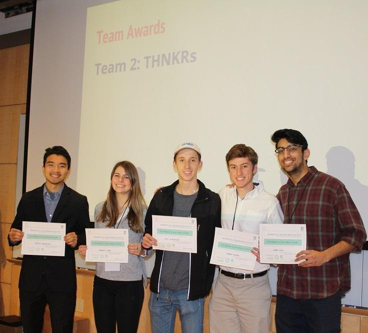

# UC Davis

[Go Back](/)

## Curriculars

### Undergraduate (2017-2021)

I graduated with a bachelor's of science in mechanical engineering with honors and a GPA of 3.8/4.0. Aside from engineering classes, I was able to take a diverse range of classes including economics, environmental design, and technical writing.

### Graduate (2021-2022)

I graduated with a master's of science in mechanical and aerospace engineering with a GPA of 3.9/4.0. I focused mainly on computational science and analysis but also had some classes on energy, manufacturing, and controls.

## Extracurriculars

### UC PLASMA

UC PLASMA was an intense, 14-week long business startup competition open to current students and alumni of all UC campuses. My most trusted friend and I worked together in a team of 2 to build our company called _Assist-X_ around the needs of at-home medical equipment. Our first product was called _AccuDropper_, a handheld, automatic eyedrop dispenser targeted for people with visual impairments or motor disabilities. By the end of the competition, each startup pitched their idea to a panel of judges. _Assist-X_ won __both__ the most improved award and first place overall.

<iframe width="560" height="315" src="https://www.youtube.com/embed/gytPDLGHiXc" title="YouTube video player" frameborder="0" allow="accelerometer; autoplay; clipboard-write; encrypted-media; gyroscope; picture-in-picture" allowfullscreen></iframe>

_The THNKRs team with their awards from the Biomedical Engineering Society Make-A-Thon, where the idea for AccuDropper originated._

### Senior Design

In 2021, I worked in a team of 6 to design a device that would aid in the research of neurobiology. Our device was to keep the head of a mouse still to conduct brain scans while allowing the rest of the mouse to experience natural movement. Our team came up with a spherical treadmill for the mouse to run on, surrounded by virtual reality screens to emulate being in a maze. We called this, the _Oculus Mouse_.

<iframe width="560" height="315" src="https://www.youtube-nocookie.com/embed/Tosy8NLFmXs" title="YouTube video player" frameborder="0" allow="accelerometer; autoplay; clipboard-write; encrypted-media; gyroscope; picture-in-picture" allowfullscreen></iframe>

[Go Back](/)